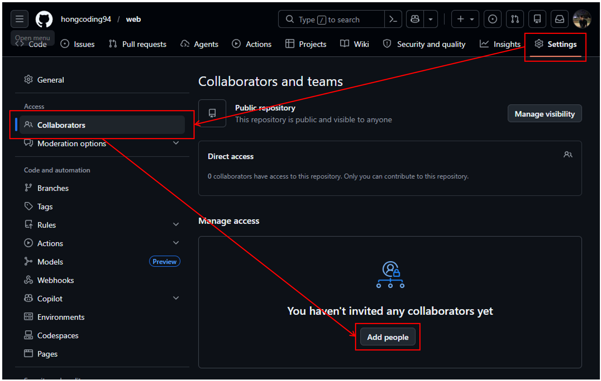
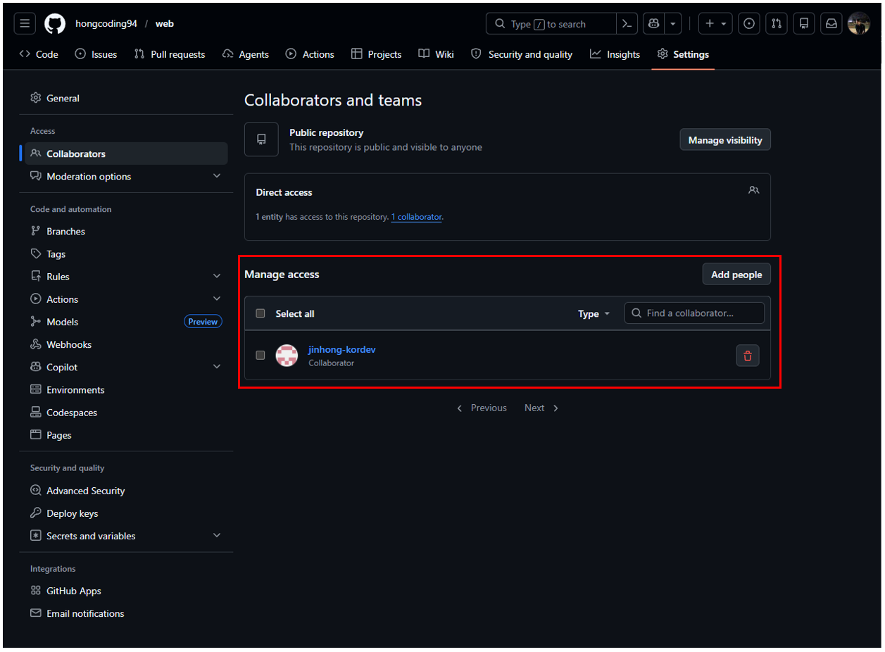

# PR 단계에서 GitHub Actions 구축하여 팀 컨벤션을 자동으로 준수하는 환경 조성
|구분|내용|
|---|---|
| **진행 상황** ||
| **최종 업데이트 시간** |2026년 4월 25일 |
| **개발 상태** | 완료 - 계속된 업데이트가 필요 |
| **기술 타입** | Git, 협업 프로세스, 형상관리 |
| **영향도** | 中 (협업 품질 · 장애 예방) |
| **이슈 여부** | 지식 기반 정리 완료 |

<br/>

## 배경 💡
>실제 프로젝트(GitLab)를 진행하는 과정에서 무분별한 Commit 및 Push로 인해 장애가 발생하였고,  
>그에 따른 로그 분석과 복구 작업으로 불필요한 시간이 반복적으로 소모되는 상황을 경험했습니다.  
>이 과정에서 일정 지연은 물론, 관리자(개발 리더)의 업무 부담이 과도하게 증가하는 문제도 확인할 수 있었습니다.
>
>이러한 문제를 사람의 주의나 리뷰에만 의존하지 않고,  
>규칙을 시스템으로 강제할 수 있는 구조가 필요하다고 판단하였으며, 그 구현 예시로를 활용해  
>오류 가능성을 최소화하고 협업 과정에서 발생하는 불필요한 비용을 줄이기 위해  
>본 가이드를 작성했습니다.
<hr/>

## 이 가이드의 적용 범위와 전제
>GitHub Actions는 GitHub에서만 지원되는 기능이며,  
>다른 Git 플랫폼에서는 동일한 기능을 그대로 사용할 수 없습니다.
>
>다만 사용하는 도구는 다를 수 있지만, 구조와 사고방식은 동일합니다.  
>이 구조를 이해한다면 GitLab이나 Jenkins 환경에서도 동일한 적용 기준을 정의할 수 있습니다.

## 구조 설명
※ 사용방법과 장단점을 언급하는 이유는  
**Git Actions를 ‘만능 관리자’로 오해하는 관점**을 바로잡기 위함입니다.

### Git Actions 사용하는 방법
1. 코드 품질 게이트  
   >현재 내용에서 다루는 내용입니다.  
   >EX. PR 단계의 정합성 체크
   - lint / test / security check 통합  
   - PR 단계에서 자동 차단  
   - 기준 미충족 시 merge 불가

2. 콘텐츠 자동 생성·정리
   >현재 "GitHub Actions 기반 포스트 데이터 자동 병합 시스템 구축"에서  
   >다룬 내용입니다.  
   >Ex. 모든 포스트글 병합 후 최신글 리스트 파일 자동 생성
   - 마크다운, JSON, 데이터 파일 자동 생성  
   - 카테고리별 콘텐츠 자동 분류  
   - 최신 데이터 자동 반영  

3. 변경 감지 기반 부분 처리  
   >콘텐츠 자동 생성·정리와 합쳐진 내용입니다.  
   >Ex. 모든 포스트글 병합 데이터와 비교 후 변경 부분만 변경 후 빌드
   - 특정 파일 변경 시만 실행  
   - 변경된 영역만 재처리  
   - 전체 재빌드 방지

4. 릴리즈 자동화  
   >빌드 전 태그를 생성 후 빌드 에러 발생 시 롤백
   - tag 생성 시 자동 빌드  
   - 배포 패키지 생성  
   - 버전별 결과 저장  

5. 로그 기반 상태 관리  
   >빌드 에러 발생 시 Email 혹은 특정 연락망을 이용
   - 실행 로그 자동 수집  
   - 실패/성공 상태 기록  
   - 특정 조건 발생 시 알림 or 재실행  

### Git Actions 사용시 장•단점
- **Git Actions 장점**
    || 구분 | 내용 | 협업에서의효과 |
    | --- | --- | --- | --- |
    |1|**일관성**|사람 컨디션과 무관하게 동일 기준 적용|리뷰 기준 흔들림 제거|
    |2|**사전차단**|PR 단계에서 문제를 미리 차단|main 장애 유입 방지|
    |3|**반복제거**|빌드·테스트·포맷 자동화|**관리자의 검증 피로 감소**|
    |4|**기준명문화**|규칙이 코드로 남음|**말로만 정한 룰** 소멸|
    |5|**확장성**|규칙 추가·변경이 용이|팀 성장에 맞춘 진화|

- **Git Actions 단점**
    || 구분 | 내용 | 실제위험 |
    | --- | --- | --- | --- |
    |1|**맥락인식불가**|변경 의도·비즈니스 의미 해석 불가|**통과했지만 위험한 PR** 발생|
    |2|**예외처리불가**|특수 상황 자동 판단 불가|불필요한 차단 발생|
    |3|**규칙의존성**|규칙이 잘못되면 장애 유발|CI가 오히려 발목 잡음|
    |4|**책임없음**|실패·성공에 대한 책임 없음|**Action이 통과시켰다** 착각|
    |5|**유지비용**|규칙 관리가 필요|방치 시 무용지물|

- **오해하는 개념 인식 정리**
    || 잘못된 인식 | 적용 후 사용자의 인식 | 유지 보수 방향성 |
    | --- | --- | --- | --- |
    |1| “CI 통과 = 안전한 변경”의 공식 ❌  | 기술적 최소 기준만 통과 | 관리자의 최종 판단 역할 강조 |
    |2| “Action이 다 막아준다” | 정의된 규칙만 기계적으로 차단 | 규칙 범위와 한계 지속 공유 |
    |3| “관리자 리뷰 줄여도 된다”  | 리뷰가 줄어드는 게 아니라 역할이 전환됨 | 관리자와 팀원들간 계속된 소통 필요 |
    |4| “한 번 만들면 끝” | 지속적 보완 필요 | 규칙 추가·수정·버그 대응 포함한 유지관리 |

> GitHub Actions의 장점은 ‘사람을 대신해 검사한다’는 것이고,  
> 단점은 ‘사람처럼 생각하지는 못한다’는 점이다.

<hr/>

## Git Actions을 통해 룰을 체크하는 로직을 구현
### 프로젝트 구조 및 유저의 권한 (예제 포함)
-  GitHub은 단순히 '권한'만 주는 것이 아니라,  
**[레포지토리 역할 부여]** 와 **[브랜치 보호 규칙]** 두 가지를 조합하여 통제 할 수 있습니다.

**① 유저별 레포지토리 역할(Role) 할당**
   - 팀원들을 레포지토리에 초대할 때 역할을 구분
      - 경로 : Settings > Collaborators and teams
         ※ 팀원이 없을 경우 (아래와 같이 **팀원을 초대가 필요**)
         
  
         ※ 팀원이 있을 경우
         

      <br/>

      - **역할의 분배 정의가 필요** [역할의 분배는 프로젝트의 규칙에 의거하여 설정]
         | 대상 | 부여할 Role | 설명 |
         | --- | --- | --- |
         | 리더 개발자 (관리자) | Admin | 모든 설정 변경, 브랜치 삭제, 머지 가능 |
         | 일반 개발자 (유저) | Write | 코드 수정, 브랜치 생성, PR 생성 가능 (설정 변경 불가) |

**② 브랜치 보호 규칙(Branch Protection Rule or Rulesets) 적용**
   - **Branches vs Rulesets 차이점 비교**
      | 구분 | Branches | Rulesets |
      | --- | --- | --- |
      | 적용 범위 | 브랜치 하나당 규칙 하나를 따로 만들어야 함. | 여러 브랜치(main, dev)를 하나의 규칙으로 묶어서 관리 가능 |
      | 권한 제어 | 권한 제어관리자 예외(Bypass) 설정이 단순함 | Bypass list를 통해 특정 사람, 팀, App만 골라 세밀하게 허용 가능 |
      | 가시성 | 가시성규칙이 적용되기 전까지는 효과를 알기 어려움 | 규칙을 적용하기 전에 **평가 모드(Evaluate)**로 테스트해 볼 수 있음 | 
      | 다중 저장소 | 다중 저장소저장소마다 매번 설정해야 함 | 조직(Organization) 단위라면 여러 저장소에 한 번에 배포 가능 |

      - 적용 방식의 차이
         -  유저(팀원) 입장 (별 차이가 없음)
            Branches에 걸었든 Rulesets에 걸었든, 규칙을 어기면 PR 화면에서 "Merge blocked" 메시지를 보게 됩니다.
            자동화 검사(check-commit-message 등)를 통과해야 버튼이 활성화되는 경험은 동일합니다.

          <br/>

         - 관리자(리더) 입장
            관리자에게는 Rulesets이 훨씬 편리합니다.
            관리 효율 측면 
               - Branches는 main 규칙 만들고, 또 dev 규칙을 동일하게 두개를 만들어야함.
               - Rulesets은 Target branches에 main, dev를 한꺼번 끝!  

            <br/>

            비상 열쇠(Bypass)
               - Branches는 "관리자도 포함할 것인가?" 정도의 옵션만 존재
               - Rulesets은 "누구에게 예외를 줄 것인지" 리스트를 명확하게 관리 가능 

   <br/>

   - Write 권한을 가진 일반 개발자가 **머지를 하지 못 하도록 막는 역할**
      - 경로 : Settings > Branches > Add branch protection rule

         - **main 브랜치 설정 / dev 브랜치 설정**
            ※ 설정방식은 비슷하지만, 각각의 Branches를 생성하여 만들어야합니다.

            |	설정 섹션	|	항목명	|	체크(✅) 여부	|	설정 값 / 대상	|
            |	---	|	---	|	---	|	---	|
            |	General	|	Ruleset Name	|	-	|	Standard-Gate (자유롭게 입력)	|
            |		|	Enforcement status	|	Active	|	실제 규칙 적용 상태	|
            |	Target	|	Target branches	|	✅	|	main, dev (패턴 추가)<br/> [ 중요 ] branches를 각각의 타겟으로 생성	|
            |	Bypass	|	Bypass list	|	✅	|	관리자(리더) 본인 계정 추가	|
            |	Rules	|	Restrict deletions	|	✅	|	브랜치 삭제 방지	|
            |		|	Block force pushes	|	✅	|	히스토리 덮어쓰기 방지	|
            |		|	Require a pull request...	|	✅	|	직접 Push 금지, PR 필수	|
            |		|	Require status checks...	|	✅	|	자동화 검사 3종 필수 통과	|


   - Write 권한을 가진 일반 개발자가 **머지를 하지 못 하도록 막는 역할**
      - 경로 : Settings > Rulesets > New branch ruleset
         - **권한별 최종 동작 방식**
            | 구분 | 일반 팀원 (Write 권한)| 관리자 (Admin / Bypass 설정) |
            | :---: | --- | --- |
            | 자동화 검사 | 필수 통과 (실패 시 머지 불가)| 통과 권장 (실패해도 강제 머지 가능) |
            | 브랜치명<br/>커밋 | 규칙	무조건 준수해야 함| 긴급 시 예외 허용 (비상 열쇠) |
            | 머지 버튼<br/>상태 | ❌ 빨간색/회색 (규칙 위반 시) | ⚠️ 경고 표시와 함께 머지 활성화 |

         <br/>

      - 
         - **Admin 권한 주요 설정 내용 (체크 리스트)**
            | 구분 | 주요 설정 사항 | 기대효과 |
            | :---: | --- | --- |
            | 강제성 | Enforcement status: Active | 실시간 적용 |
            | 비상 제어 | Bypass list: Repository admin | 긴급 상황 대응 |
            | 보호 대상 | Target branches: main, dev | 핵심 자산 보호 |
            | 흐름 제어 | Require a pull request before merging | 코드 리뷰 의무화 |
            | 품질 보증 | Require status checks to pass<br/> - check-branch-name<br/> - check-commit-message<br/> - check-pr-title | 자동 검증 강제 |
            | 최신성 유지 | Require branches to be up to date before merging | 충돌 미연 방지 |
            | 안전성 | Block force pushes<br/>Restrict deletions | 히스토리 파괴 방지 |

         <br/>

         -  **Write 권한 주요 설정 내용 (체크 리스트)**
            | 구분 | 주요 설정 사항 | 기대효과 |
            | :---: | --- | --- |
            | 기본 보호 | Restrict deletions | 실수나 고의로 중요 브랜치를 삭제하는 것을 방지 |
            | 히스토리<br/>관리 | Block force pushes | git push -f를 차단 |
            | 승인 절차 | Require a pull request before merging | 브랜치에 직접 코드를 넣지 못하게 하고, 반드시 PR을 생성하여 자동화 검사 통과 필요 | 
            | 자동화 검증 | Require status checks to pass<br/> - check-branch-name<br/> - check-commit-message<br/> - check-pr-title | 우리가 만든 Git-Standard-Check가 통과되어야만 머지 버튼이 활성화 |

**③ 관리자 전용 '비상 열쇠' 설정 (Bypass)**
   - Admin 권한을 가진 리더 개발자가 긴급하게 규칙을 어겨야 할 때(긴급 패치 등)  
   아래와 같이 설정하여 긴급 패치가 가능 할 수 있다.


위 내용을 통해서 아래와 같은 흐름을 유도할 수 있습니다.
1. 유저 A (Write 권한)  
   feature/login 브랜치를 만들고 코드를 짠 뒤 dev로 PR을 날림 → Actions 검사 대기 → 리더 승인 후 머지 완료.

2. 유저 A의 실수  
   실수로 main 브랜치에 직접 push 시도 → "Permission Denied" 발생 (보호 규칙이 차단).

3. 관리자 B (Admin 권한) [상황 - 서버 장애 발생!] 
   급하게 코드를 고치고 main으로 바로 머지 시도 → Bypass 기능을 이용해 테스트 통과 기다리지 않고 즉시 반영.


### Git Actions이 구성되지 않은 프로젝트
   - 자동화가 없는 프로젝트는 '사람의 주의력'에 전적으로 의존하며,  
   간단한 오류임에도 불구하고 확인 도중 프로젝트 시간 딜레이가 될수 있다.
      - **휴먼 에러**  
         PR 제목 형식이나 간단한 오타, 테스트 미실행 등을 리뷰어가 일일이 확인해야 함.
      
      - **품질 저하**  
         바쁜 일정 속에서 테스트를 건너뛰고 머지할 경우, dev 브랜치 전체가 오염될 위험이 높음.

      - **강제성 부재**  
         "하지 마세요"라는 가이드는 있지만, 기술적으로 막을 방법이 없어 규칙이 쉽게 무너짐.

### Git Actions이 구성된 프로젝트 (예제 포함)

   - **기본적인 워크플로우 제어 (Branch Flow & Test)**
      브랜치로의 직접적인 병합을 제한하고, Git Actions를 활용해 
      PR의 의미론적 품질과 코드 안정성을 동시에 확인합니다.
      
      <br/>

      ```YAML
      name: PR Quality and Flow Check

      on:
         pull_request:
            branches: [main, dev]

         jobs:
            validate:
               runs-on: ubuntu-latest
               steps:
                  - uses: actions/checkout@v4

                  # 1. 잘못된 브랜치 흐름 차단 (feature -> main 직접 접근 시 실패)
                  - name: Check Branch Flow
                  if: github.base_ref == 'main' && github.head_ref != 'dev'
                  run: |
                     echo "❌ ERROR: Only 'dev' branch can be merged into 'main'."
                     exit 1

                  # 2. PR 제목 규칙 체크
                  - name: Check PR Title
                  uses: amannn/action-semantic-pull-request@v5
                  env:
                     GITHUB_TOKEN: ${{ secrets.GITHUB_TOKEN }}

                  # 3. 테스트 코드 실행
                  - name: Run Tests
                  run: |
                     npm install
                     npm test
      ```


   - **Git 표준 강제 자동화 (Custom Standard Check)**
      정규표현식을 사용하여 팀이 정의한 브랜치 전략과 커밋 컨벤션을 엄격하게 검사
      모든 커밋 히스토리를 추적하여 누락 없는 표준화를 실현
      
      <br/>

      ```YAML
      name: Git-Standard-Check-Upgrade-Version

      on:
         pull_request:
            types: [opened, edited, synchronized]
            branches: [main, dev]

         permissions:
            contents: read
            pull-requests: read

         jobs:
            # 1. 브랜치 전략 검사
            check-branch-name:
               runs-on: ubuntu-latest
               steps:
                  - name: Validate Branch Name
                  run: |
                     BRANCH_NAME="${{ github.head_ref }}"
                     REGEX="^(feature|bugfix|hotfix|docs)\/.*"
                     
                     if [[ ! $BRANCH_NAME =~ $REGEX ]]; then
                        echo "❌ [ERROR] 브랜치명이 규칙에 어긋납니다!"
                        echo "허용 접두사: feature/, bugfix/, hotfix/, docs/"
                        exit 1
                     fi

            # 2. 커밋 메시지 품질 검사
            check-commit-message:
               runs-on: ubuntu-latest
               steps:
                  - name: Checkout code
                  uses: actions/checkout@v4
                  with:
                     fetch-depth: 0

                  - name: Validate Commit Messages
                  run: |
                     # 추출된 커밋들을 배열로 저장하여 서브쉘 이슈 방지
                     BASE_SHA="${{ github.event.pull_request.base.sha }}"
                     HEAD_SHA="${{ github.event.pull_request.head.sha }}"
                     
                     # 커밋 목록 추출 (Merge 커밋 제외를 원하면 --no-merges 추가)
                     mapfile -t COMMIT_ARRAY < <(git log --format=%s $BASE_SHA..$HEAD_SHA)
                     
                     REGEX="^\[(Feat|Fix|Refactor|Remove|Bug)\].*"
                     ERROR_COUNT=0

                     for msg in "${COMMIT_ARRAY[@]}"; do
                        if [[ ! $msg =~ $REGEX ]]; then
                        echo "❌ [ERROR] 커밋 메시지 형식 오류: \"$msg\""
                        ERROR_COUNT=$((ERROR_COUNT + 1))
                        fi
                     done

                     if [ $ERROR_COUNT -ne 0 ]; then
                        echo "총 $ERROR_COUNT 개의 커밋이 표준을 준수하지 않습니다."
                        exit 1
                     fi
                     echo "✅ 모든 커밋 메시지 형식 통과!"

            # 3. PR 제목 검사
            check-pr-title:
               runs-on: ubuntu-latest
               steps:
                  - name: Validate PR Title
                  run: |
                     PR_TITLE="${{ github.event.pull_request.title }}"
                     # 예: "[Feat] 기능 구현" 형태인지 검사
                     if [[ ! $PR_TITLE =~ ^\[(Feat|Fix|Refactor|Remove|Bug)\].* ]]; then
                        echo "❌ [ERROR] PR 제목 형식을 맞춰주세요!"
                        exit 1
                     fi
      ```

   - 주요 GitHub Context 변수 설명
      워크플로우 내부에서 현재 실행 환경의 상태를 파악하기 위해 사용하는 **'정해진 패턴'**

      |패턴 (Variable)|의미|
      | --- | --- |
      |${{ github.actor }}|워크플로우를 실행시킨 사람 (ID)|
      |${{ github.repository }}|현재 레포지토리 이름 (user/repo)|
      |${{ github.head_ref }}|현재 작업 중인 브랜치명 (출발지)|
      |${{ github.base_ref }}|목표 브랜치명 (목적지 - main 등)|

      <br/>

### Git Actions 유무에 따른 비교점
   - Git Actions 유무에 따른 사용 후 비교점
      | 구분 | Git Actions 미구성 | Git Actions 구성 | 기대 값 |
      | :---: | --- | --- | --- |
      | **품질 유지<br/>(안정성)** |사람의 컨디션에 따라 검증 수준이 달라짐 테스트를 깜빡하고 머지할 위험 상존|모든 PR에 대해 정해진 테스트와 Lint 검사를 강제로 수행 실패 시 머지 불가|결함 있는 코드가 상용 브랜치에 섞이는 것을 차단|
      | **리뷰<br/>효율** |"커밋 메시지 틀렸어요", "오타 있네요" 같은 단순 피드백에 리뷰 에너지 낭비|기계적인 규칙 검사는 봇(Bot)이 전담 리뷰어는 로직의 효율성과 설계 방향에만 집중| 리뷰 시간 단축 및 고차원적인 기술 피드백 활성화|
      | **거버넌스<br/>(흐름제어)** |main에 직접 푸시하거나 잘못된 브랜치로 머지하는 실수를 수습하는 데 비용 발생|Branch Protection & Rulesets과 연동하여 승인되지 않거나 검증되지 않은 흐름을 자동 차단|주니어 개발자도 실수 걱정 없이 안심하고 개발할 수 있는 환경 조성|
      | **협업 투명성** |"이거 테스트 해보셨나요?"라고 매번 물어봐야 하는 구두 합의와 신뢰에 의존|PR 화면에 검사 결과(✅/❌)가 투명하게 공개됨 시스템이 보증하는 데이터를 기반으로 소통|커뮤니케이션 비용 감소 및 팀 전체의 개발 속도 향상|

<hr/>

## Git Actions를 구현하고 추가적인 내용
### "Git Actions은 관리자가 아니다"라는 인지가 필요
>이제 Actions이 다 알아서 걸러주겠지 혹은 관리자는 신경 안 써도 되겠네!  
>생각하지만 이 인식은 다소 위험발상이다.  
>
>Actions은 판단하지 않는다.
>의도를 이해하지도 않고, 프로젝트의 맥락을 해석하지도 않는다.  
>Git Actions이 할 수 있는 일은 단 하나다.  
> 
> **사전에 정의된 규칙을 기계적으로 검사하고, 결과를 반환하는 것임을 명심해야한다.**

### Git Actions와 관리자의 역할 분류 [ 중요 ]
※ 내용을 숙지하여 향후 문제에 대해서 판단 할 수 있는 관리자(개발 리더)가 되어야한다.
| 구분 | Git Actions | 관리자 |
| --- | --- | --- |
| **역할 성격** | 자동 검증 도구 | **최종 의사결정 주체** |
| **판단 기준** | 사전에 정의된 규칙 | **프로젝트 맥락과 의도** |
| **빌드 상태** | 빌드가 되는지 검사 | 빌드 결과를 참고 |
| **테스트** | 테스트 통과 여부만 확인 | 테스트가 충분한지 판단 |
| **규칙 위반** | 형식·룰 위반 여부 차단 | 예외 허용 여부 결정 |
| **변경 의도** | ❌ 판단 불가 | ✅ 판단 가능 |
| **비즈니스 로직** | ❌ 이해 불가 | ✅ 검증 필요 |
| **타이밍 판단** | ❌ 불가 | ✅ 가능 (릴리즈/리스크) |
| **결과** | **머지 가능 / 불가능** | **머지해야 하는가 / 아닌가** |

### Action으로 막을 수 있는 사고 / 못 막는 사고


- 실제 사례 비교
  | 구분 |예시 |
  | ---|--- |
  | ✅ 막을 수 있음 | - 테스트 실패한 PR merge<br>- 빌드 깨진 상태 배포<br>- lint 규칙 위반 코드<br>- 브랜치 규칙 위반 (main 직접 push)<br>- 커밋 메시지 형식 오류  |
  | ❌ 막을 수 없음 | - 잘못된 비즈니스 로직 설계<br>- 요구사항 오해로 구현된 기능<br>- 성능은 통과했지만 구조적으로 잘못된 코드<br>- 팀 방향성과 다른 설계 결정<br>- 운영 환경 고려 부족 |

- 핵심 구조
    | 영역 | 설명 |
    | --- | --- |
    | **Actions 영역** | “규칙으로 정의 가능한 문제” |
    | **사람 영역** | “맥락과 판단이 필요한 문제” |

## 결론
GitHub Actions를 단순히 Jenkins로 이어지는 파이프라인의 일부로 사용하는 것이 아니라,
PR 단계에서 협업 규칙과 기술적 기준을 사전에 검증하는 CI 방어선으로 활용했다.

이를 통해 관리자는 세부 검증이 아닌
변경의 적절성만 판단하고 승인하는 역할에 집중할 수 있었고,
결과적으로 장애 대응 및 불필요한 검증 시간을 크게 줄일 수 있었다.

<hr/>

## 자동화는 사람을 줄이는 기술이 아니라 판단을 돕는 구조
**AI·Automation은 대체재가 아니라 협업 파트너**  
이 글을 작성하는 도중 개발자들과 AI등 개발 관련된 이야기를 많이 하다보니 생각이 많아 이글을 적게 된건지 모르겠다.

누군가는 AI와 자동화 도입에 대해 부정적으로 바라보고,
또 누군가는 이를 통해 생산성과 효율이 크게 올라간다고 이야기한다. 이 두 관점은 모두 틀렸다고 보기 어렵다.
다만 중요한 건 기술 자체의 문제가 아니라, 그것을 어떻게 이해하고 어떤 기대를 가지고 사용하는지에 있다.

이 글을 작성하는 나 역시 자동화와 AI를 실제로 사용하면서 많은 것을 느꼈다. 어떤 순간에는 “이 정도까지 가능하다고?”라는 생각이 들 정도로 놀라기도 했고, 반대로 “이건 결국 사람이 해야 하는 영역이구나”라는 걸 체감하며 허탈하게 웃었던 적도 있다. 하지만 시간이 지나면서 분명하게 정리된 한 가지 생각이 있다.

인류는 항상 불편함을 줄이고 편리함을 얻기 위해 도구를 만들어 왔고, 그 도구를 활용하면서 더 나은 방향으로 성장해 왔다는 점이다.
AI와 자동화 역시 그 흐름 위에 있는 하나의 도구일 뿐이다.

---
**GitHub Actions나 AI를 도입할 때 가장 흔하게 나오는 질문이 있다.**  

“이 정도면 관리자나 리뷰 인력을 줄여도 되는 것 아닌가?”

하지만 이 질문에는 이미 하나의 전제가 들어 있다.
AI와 자동화를 사람을 대신하는 존재로 보고 있다는 점이다.

---

실제로 AI와 Automation은 사람을 대체하기 위한 기술이 아니다.  
반복적으로 발생하는 검증 작업을 대신 수행하고, 사람이 더 중요한 판단과 설계에 집중할 수 있도록 돕는 역할에 가깝다.  
즉, 일을 없애는 기술이 아니라 사람의 시간을 더 중요한 곳으로 이동시키는 기술이다.

이 관점에서 보면 중요한 건 “대체 여부”가 아니다. 오히려 역할이 어떻게 나뉘는가이다.

사람은 여전히 판단하고, 책임지고, 방향을 결정해야 한다.  
반면 시스템은 반복적인 검증과 규칙 기반의 체크를 담당한다. 이 둘이 나뉘었을 때 비로소 협업 구조가 안정적으로 돌아간다.

**정리하면 결국 이렇다.**  
AI와 GitHub Actions는 개발자를 대체하는 도구가 아니라,
개발자의 부담을 줄이고 더 중요한 판단에 집중할 수 있도록 돕는 협업 도구라 생각한다.

자동화를 잘 활용하는 팀이 강해지는 이유는 인원을 줄였기 때문이 아니라,
사람이 해야 할 일과 시스템이 해야 할 일이 명확하게 분리되기 때문이다. 
그 결과 사람은 판단에 집중하고, 시스템은 검증에 집중하게 된다.

그리고 이런 구조가 만들어질 때 비로소 협업은 “빠르게 일하는 상태”가 아니라, "**안정적으로 판단이 가능한 상태**"로 바뀐다.